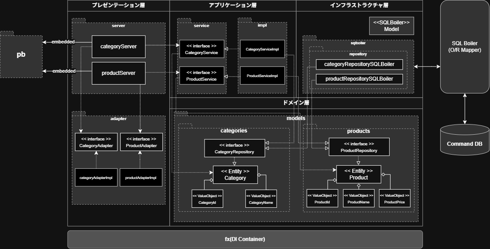
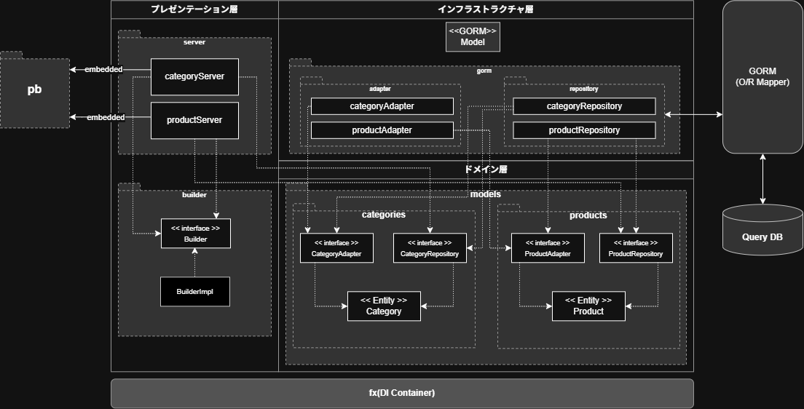

# go-microservices

This repository is a hands-on implementation of microservices architecture based on the book *"Hands-on Microservices Development with Go and gRPC"*.

---

## 📌 Overview

This project unifies the 5 separate repositories used in the book (Protocol Buffers, Command Service, Query Service, CQRS Client, and Databse/Docker) into a single monorepo to streamline development and maintenance workflows.

### 📐 Architecture Diagram

#### 🔹 Command Service



#### 🔹 Query Service




### Key Tech Stack
- **Language**: Go v1.26.5
- **OS / Environment**: WSL2 (Debian) / VS Code (Remote-WSL)
- **Architecture**: CQRS (Command Query Responsibility Segregation) / Clean Architecture / Microservices
- **RPC Framework**: gRPC / Protocol Buffers (`protoc` libprotoc v35.1)
- **Protoc Plugins**:
  - `protoc-gen-go`: v1.36.11
  - `protoc-gen-go-grpc`: v1.6.2
- **Database**: MySQL v8.0.46 (Docker / Docker Compose)
- **Web Framework**: Gin (CQRS Client)
- **DI / Application Framework**: Uber `fx`
- **BDD Testing**: Ginkgo v2 (v2.32.0) / Gomega (v1.42.1)

---

## 📁 Directory Structure

The repository structure consolidates API definitions and service components as follows:

```text
.
├── api/                       # API definitions & generated code
│   ├── pb/v1                  # Go code generated by protoc
│   ├── proto/v1               # Protocol Buffers (.proto definitions)
│   ├── buf.gen.yaml
│   └── buf.yaml
├── apps/
│   ├── command-service/       # Write-side service (Command Service)
│   ├── query-service/         # Read-side service (Query Service)
│   └── cqrs-client/           # Client API Gateway (Gin HTTP server)
├── db/                        # DB initialization scripts, my.cnf, etc.
│   └── docker-compose.yaml    # MySQL database & container setups
├── docs/
├── Makefile                   # Protobuf build, DB startup, service run commands
├── go.mod
├── go.sum
└── README.md
```

---

## 🛠️ Database Replication Setup
<details><summary>Click to expand</summary>


Step-by-step instructions for setting up MySQL replication (`command_db` -> `query_db`).

> ⚠️ **Note:** Replace placeholders such as  `<MYSQL_ROOT_PASSWORD>` and `<REPLICATION_PASSWORD>` with your actual credentials.

### 1. Create and Start Containers

```bash
docker compose up -d
```

### 2. Create Replication User and Grant Privileges

Connect to `command_db` (Master) to create a replication user and grant necessary privileges.
```bash
# Connect to command_db (you will be prompted for the root password)
docker compose exec command_db mysql -u root -p
```
Run the following inside the MySQL CLI:
```sql
-- Create user 'repl' with your replication password
CREATE USER 'repl'@'%' IDENTIFIED BY '<REPLICATION_PASSWORD>';

-- Verify user creation
SELECT user, host FROM mysql.user;

-- Grant replication privileges
GRANT REPLICATION SLAVE ON *.* TO 'repl'@'%';

-- Verify granted privileges
SHOW GRANTS FOR 'repl'@'%';

-- Exit MySQL CLI
QUIT;
```

### 3. Create Backup (Dump) and Restore

Dump data from `command_db` and restore it to `query_db` (Replica).
```bash
# Create backup from command_db
docker compose exec command_db bash -c 'mysqldump -u root -p"<MYSQL_ROOT_PASSWORD>" --all-database --flush-logs --single-transaction --source-data > /etc/ddl/master.db'

# Copy backup file to query directory
cp command/DDL/master.db query/DDL/

# Restore backup into query_db
docker compose exec query_db bash -c 'mysql -u root -p"<MYSQL_ROOT_PASSWORD>" < /etc/ddl/master.db'
```

### 4. Configure and Start Replication

### ① Retrieve Binary Log Information
Open the generated `master.db` (dump file) and locate the `CHANGE MASTER TO` statement near the top to retrieve the following values:
- `MASTER_LOG_FILE` (e.g., `'binlog.000001'`)
- `MASTER_LOG_POS` (e.g., `154`)

### ② Configure and Start on `query_db`
```bash
# Connect to query_db
docker compose exec query_db mysql -u root -p
```

Run the following inside the MySQL CLI (replace placeholders with the actual values):
```sql
-- Configure replication settings
CHANGE MASTER TO
MASTER_HOST='command_db',
MASTER_PORT=3306,
MASTER_USER='repl',
MASTER_PASSWORD='<REPLICATION_PASSWORD>',
MASTER_LOG_FILE='<MASTER_LOG_FILE_VALUE>',
MASTER_LOG_POS=<MASTER_LOG_POS_VALUE>;

-- Start replication
START SLAVE SQL_THREAD;

-- Exit MySQL CLI
QUIT;
```

### ③ Restart Containers and Verify Status
```bash
# Restart containers
docker compose restart

# Connect to query_db to check status
docker compose exec query_db mysql -u root -p
```

Check the status inside the MySQL CLI:
```sql
SHOW SLAVE STATUS\G;
```
> 💡 Verify that `Slave_IO_State: Waiting for source to send event`.


### 5. Create Tables, Insert sample Data, and Verify Replication

Execute schema creation and data insertion on `command_db`. The change will automatically replicate to `query_db`.
```bash
# 1. Create tables in sample_db
docker compose exec -T command_db mysql -u root -p"<MY_SQL_ROOT_PASSWORD>" sample_db < create_object.sql

# 2. Insert sample data into sample_db
docker compose exec -T command_db mysql -u root -p"<MY_SQL_ROOT_PASSWORD>" sample_db < create_record.sql

# 3. Verify record count on command_db (Master)
docker compose exec command_db mysql -u root -p"<MY_SQL_ROOT_PASSWORD>" sample_db -e "SELECT COUNT(*) FROM product;"

# 4. Verify data replication on query_db (Replica)
docker compose exec query_db mysql -u root -p"<MY_SQL_ROOT_PASSWORD>" sample_db -e "SELECT COUNT(*) FROM product;"
```

</details>
